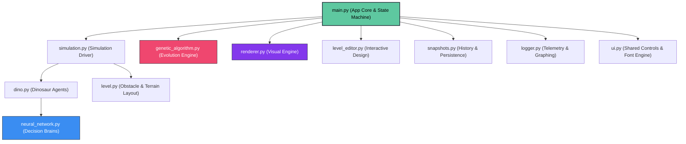
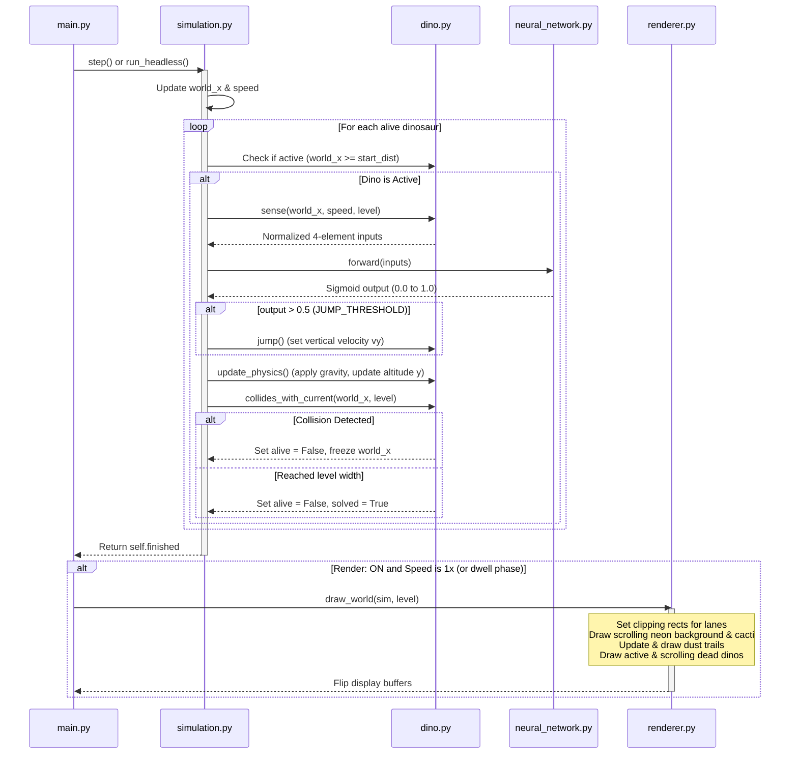

# NeuroDino System Architecture & Component Guide

Welcome to the comprehensive guide for **NeuroDino** — a standalone neuroevolution Chrome Dinosaur simulation. This document explains the role of each file, how they are wired together, the data flows between them, and the visual/genetic mechanics that power the application.

---

## 1. System Overview

NeuroDino trains a population of **100 neural-network-driven dinosaurs** to navigate an obstacle course (cactus layouts) in a simulated environment. Using a **Genetic Algorithm (GA)**, the system evaluates the fitness of each dinosaur at the end of a generation and breeds the next generation using selection, crossover, and mutation.



---

## 2. File-by-File Component Breakdown

### 📂 App Control & Configuration
*   **`main.py`**
    *   *Role*: The central coordinator and application entry point.
    *   *Responsibilities*:
        *   Initializes Pygame in hardware-accelerated Fullscreen mode (`pygame.FULLSCREEN | pygame.DOUBLEBUF | pygame.HWSURFACE`) and prompts `config.py` to scale layout bounds.
        *   Implements the core state machine: `TRAINING` (running or paused), `REPLAY` (single champion playback with live network overlay), `HISTORY` (scrolling historical snapshots), and `EDITOR` (level editing).
        *   Manages the 60 FPS update-draw loop, handles keystrokes/hotkeys, and handles sidebar button interactions.
*   **`config.py`**
    *   *Role*: Global configuration and environment settings.
    *   *Responsibilities*:
        *   Contains all tunable constants (e.g. population sizes, mutation rates, neural network sizes, level geometry, physics constants).
        *   Defines color tokens (`COL_BG`, `COL_ACCENT`, `COL_DEAD`) and the 10 fixed vibrant dinosaur slot colors (`DINO_COLORS`).
        *   Exposes `init_layout(w, h)` to dynamically recalculate game area width, sidebar, and lane sizes based on fullscreen display metrics.
        *   Computes level-wide speed ramps based on distance traveled.
*   **`ui.py`**
    *   *Role*: Shared visual elements and layout utilities.
    *   *Responsibilities*:
        *   Maintains a global font cache (`_FONT_CACHE`) using Pygame's default font rendering to avoid external OS font dependencies.
        *   Draws labels, color shades, progress bars, and custom buttons with active/hover styling.
        *   Contains the dinosaur slot color mapping (`ui.dino_color(slot)`).

### 📂 Physics & Simulation
*   **`dino.py`**
    *   *Role*: Implements the individual dinosaur agent.
    *   *Responsibilities*:
        *   Tracks physics attributes (y-altitude, vertical velocity `vy`, on-ground state, active life/crashed/solved status).
        *   Generates the normalized 4-element sensor vector:
            1.  `distance_to_cactus` (normalized to `SENSOR_RANGE`)
            2.  `cactus_height` (normalized to `MAX_CACTUS_HEIGHT`)
            3.  `game_speed` (normalized to the min-max speed span)
            4.  `dino_altitude` (normalized to `MAX_JUMP_HEIGHT`)
        *   Evaluates jump physics under gravity (`config.GRAVITY`) and detects bounding-box collisions with cacti.
        *   Computes its non-negative fitness score: `distance * 1.0 + obstacles_cleared * 200`.
*   **`simulation.py`**
    *   *Role*: Drives a single generation of 100 dinosaurs.
    *   *Responsibilities*:
        *   Initializes dinosaurs and implements `_advance_frame()`, running physics, sensor updates, neural net queries, and collision checks.
        *   Handles the starting distance offset (`config.DINO_SPACING = 80`) so that dinosaurs start incrementally rather than clustered together.
        *   Exposes `step()` for 1x rendering loops, and `run_headless()` to run physics at maximum CPU throughput for 2x/5x/10x speeds.
*   **`level.py`**
    *   *Role*: Manages the layout of cacti.
    *   *Responsibilities*:
        *   Implements the `Obstacle` class (wrapping $x$, $width$, $height$) and the `Level` class.
        *   Maintains sorted list of obstacles by $x$ coordinate for $O(\log N)$ sensor scanning.
        *   Handles loading/saving levels from disk in JSON format (`levels/*.json`).

### 📂 Evolution Engine
*   **`neural_network.py`**
    *   *Role*: Provides the feed-forward neural network "brain" for each dinosaur.
    *   *Responsibilities*:
        *   Implements a static 3-layer architecture: **4 Inputs** $\rightarrow$ **8 Hidden Neurons (ReLU)** $\rightarrow$ **1 Output Neuron (Sigmoid)**.
        *   Decodes/encodes weights and biases into a flat 49-value genome list (`to_list` and `from_list`).
        *   Performs standard matrix multiplication forward passes using NumPy.
*   **`genetic_algorithm.py`**
    *   *Role*: Orchestrates neuroevolution between generations.
    *   *Responsibilities*:
        *   Breeds the next population from the current one:
            1.  **Elitism**: Clones the top 6 performers directly into the next generation.
            2.  **Selection**: Uses tournament selection (contestant size 5) to pick parents.
            3.  **Crossover**: Applies uniform crossover (75% probability) to exchange genes.
            4.  **Mutation**: Perturbs weights with Gaussian noise (15% probability per weight).

### 📂 Presentation, Logging & History
*   **`renderer.py`**
    *   *Role*: Stateless graphics drawer.
    *   *Responsibilities*:
        *   Draws the game tracks with high-fidelity styling: dark vertical gradients, glowing neon ground tracks, and neon cactus blocks.
        *   Applies a rendering clip rectangle (`s.set_clip`) per lane to ensure dinosaurs never cross boundaries during high jumps.
        *   Applies the spacing coordinate transformation to show dinosaurs trailing behind the leader in a train.
        *   Manages a running particle system that shoots colorful dust trails behind running dinosaurs.
        *   Draws the champion replay (complete with live neural-network input/output progress bars), scrolling history lists, and the sidebar leaderboard.
*   **`level_editor.py`**
    *   *Role*: Interactive level design interface.
    *   *Responsibilities*:
        *   Displays a dedicated construction screen where clicking places/drags cacti and right-clicking deletes them.
        *   Maintains a horizontal scroll view and saves levels directly to JSON files.
*   **`logger.py`**
    *   *Role*: Records telemetry and exports metrics.
    *   *Responsibilities*:
        *   Logs telemetry metrics to `output/training_log.csv` (Gen #, Best Fitness, Avg Fitness, Champion ID, Alive count, Solved count, Elapsed time).
        *   Spawns Matplotlib plotting processes to render and save graphs (`best_fitness.png`, `avg_fitness.png`, `alive_count.png`) using the headless `Agg` backend.
*   **`snapshots.py`**
    *   *Role*: Persists historical models.
    *   *Responsibilities*:
        *   Saves a snapshot of every generation (containing best fitness, average fitness, and the champion genome list) into `output/generation_history.json`.
        *   Loads history files on startup so players can immediately replay previous champions.

---

## 3. How Components Work Together

### A. Initialization Loop
When the application launches, the state machine starts up:

```
[App Entry]
    │
    ▼
[main.py: App.__init__]
    ├── 1. Initialize Pygame, get desktop size, set FULLSCREEN mode
    ├── 2. Call config.init_layout(w, h) to scale widths/heights dynamically
    ├── 3. Load Level (level.py) & load Snapshot History (snapshots.py)
    ├── 4. Generate initial random population (genetic_algorithm.py)
    ├── 5. Instantiate Simulation (simulation.py) & Renderer (renderer.py)
    └── 6. Begin Main App Loop
```

---

### B. Frame Update & Physics Flow (TRAINING State)
Every frame of the training loop advances simulation steps and draws to the screen:



---

### C. Generation Transition & Evolution
When all 100 dinosaurs have either crashed or solved the level (meaning `sim.finished` is True):

```
[Simulation Finished]
    │
    ▼
[Verify Auto Start Option]
    ├── Auto Start ON  ──► Proceed immediately to breeding
    └── Auto Start OFF ──► Set self.running = False, pause loop (User reviews statistics)
                           When user hits "Resume" or "Space" ──► Proceed to breeding
    │
    ▼
[Complete Generation]
    ├── 1. Finalize fitness scores: fitness = distance * 1.0 + obstacles_cleared * 200
    ├── 2. Record CSV log line (logger.py) & append historical snapshot (snapshots.py)
    ├── 3. Breed next generation (genetic_algorithm.py)
    │       ├── Copy top 6 performers unchanged (Elitism)
    │       ├── Select parents via tournament selection (Selection)
    │       ├── Mix genes at 75% probability (Crossover)
    │       └── Nudge weights with Gaussian noise (Mutation)
    └── 4. Re-instantiate Simulation with generation += 1 and new population
```

---

### D. Champion Replay Flow (REPLAY State)
When the user clicks **Replay Champ** or presses `R`, `main.py` boots a standalone replay environment:
1.  Retrieves the historical record `best_ever` from `GenerationHistory`.
2.  Creates a single Dinosaur using the saved `champion_genome` weights.
3.  Spawns a clean `Simulation` containing only this single dinosaur.
4.  Sets state to `REPLAY`. The update loop feeds the dinosaur's neural network inputs directly to a live overlay box drawn by `Renderer.draw_replay`, showcasing how the AI senses and reacts in real-time.

---

### E. Scrolling History View (HISTORY State)
Clicking **Prev Gens** or pressing `H` switches the state to `HISTORY`:
1.  Draws the simulation world in the background as a darkened backdrop.
2.  Pulls the list of all snapshots inside `GenerationHistory` and renders them in a clipping panel using `Renderer.draw_history_list`.
3.  Allows the player to scroll the list via mouse wheel or arrow keys.
4.  Clicking a row loads that specific generation's champion genome and starts a `REPLAY` playback.

---

### F. Building & Editing levels (EDITOR State)
Clicking **Level Editor** or pressing `E` launches the in-game level editor:
1.  Initializes `LevelEditor` with the path to `levels/default_level.json`.
2.  The editor intercepts mouse inputs: clicks place or grab obstacles, dragging moves obstacles, and right-clicks delete them.
3.  Pressing `S` serializes the layout back to JSON.
4.  Pressing `Esc` hot-reloads the level and returns the user to the `TRAINING` state, where the new level will be loaded.

---

## 4. Key Customization Handles

If you wish to experiment with how the dinosaurs learn, modify the following parameters in `config.py`:
*   **`POPULATION_SIZE`**: Set to 100. Increase to give the algorithm more options to explore (requires CPU power), or decrease for lighter evaluations.
*   **`MUTATION_RATE`**: The probability (default 15%) that a specific weight is mutated. Higher values create more random exploration, lower values refine existing solutions.
*   **`CROSSOVER_RATE`**: Probability (default 75%) that parent genomes are blended during reproduction.
*   **`DINO_SPACING`**: Spacing distance (default 80 pixels) between starting dinosaurs. Increase to spread them out further, decrease to cluster them.
*   **`NN_HIDDEN_SIZE`**: Number of hidden layer neurons (default 8). Increasing allows the brain to solve more complex layouts, but requires more generations to converge.
